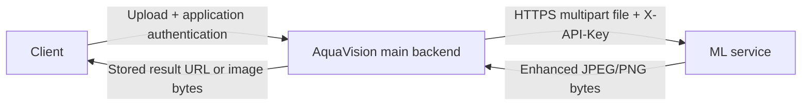

# AquaVision ML API — Backend Integration Handoff

**Recipient:** AquaVision backend engineer  
**ML service owner:** Sumit Jadhav  
**Live contract checked:** 2026-10-02 19:46 UTC / 2026-10-03 IST  
**Service version:** `0.2.0`  
**Model version:** `unet-feather-v2-t192-o64-0ef26234c656`

This document describes the currently deployed API. The shared API secret is intentionally excluded and must be supplied separately through the team's private secret-sharing channel. There is no need to install PyTorch, load model files, or reproduce the inference pipeline in the main backend.

## 1. Connection details

| Item | Value |
|---|---|
| Base URL | `https://aquavision-ml-service-cxf5.onrender.com` |
| Preferred endpoint | `POST /v1/enhance` |
| Compatibility endpoint | `POST /enhance` — same implementation |
| Full preferred URL | `https://aquavision-ml-service-cxf5.onrender.com/v1/enhance` |
| Transport | HTTPS |
| Request encoding | `multipart/form-data` |
| File field | `file` |
| Authentication | Required `X-API-Key` header |
| Successful response | HTTP 200, raw JPEG or PNG image bytes |
| API documentation | https://aquavision-ml-service-cxf5.onrender.com/docs |
| OpenAPI schema | https://aquavision-ml-service-cxf5.onrender.com/openapi.json |
| Readiness | https://aquavision-ml-service-cxf5.onrender.com/ready |
| Live configuration | https://aquavision-ml-service-cxf5.onrender.com/info |

Use the endpoint exactly as shown, without a trailing slash. Keep the base URL in trusted server configuration rather than accepting a user-supplied destination URL. The service has no batch, asynchronous job, polling-result, image-URL input, base64 JSON, storage, or cancellation endpoint.

## 2. Ownership and integration flow



**Main backend responsibilities:** authenticate the application user; apply application authorization/quotas/business rules; validate and prepare the upload; call the ML API; handle timeouts/errors; store the original/result using the application's storage; persist job/project metadata; return an appropriate result to the client.

**ML service responsibilities:** authenticate the calling backend; validate image/file limits; apply EXIF orientation; run enhancement; return image bytes or a controlled error; report readiness and inference metadata.

The frontend must call the main backend. It must not receive the ML API secret or call the ML API directly. Server-to-server requests do not require browser CORS configuration. User JWTs, sessions, credits, database IDs and application credentials are not required by this service. Do not add them as multipart fields.

## 3. Backend environment configuration

Configure these in the main backend's environment/secret manager:

```dotenv
AQUAVISION_ML_BASE_URL=https://aquavision-ml-service-cxf5.onrender.com
AQUAVISION_ML_API_KEY=<shared secret supplied privately>
AQUAVISION_ML_TIMEOUT_SECONDS=180
```

The ML service itself calls the secret `AQUAVISION_API_KEY`; the suggested backend variable is `AQUAVISION_ML_API_KEY`. Their **values must match exactly**. The HTTP header is always `X-API-Key`.

- Supply the raw key value, with no `Bearer` prefix, extra quotes, spaces or line breaks.
- Keep it out of frontend environment variables, source control, screenshots, tickets and logs.
- The service currently accepts one key; there is no built-in overlap period for key rotation. Coordinate changing the backend secret and the ML service's environment/deployment.
- Replace the key previously shared in this conversation before distributing the handoff. Do not put the replacement in this document.
- Missing/wrong caller key returns 401. A missing server-side key returns 503, and `/ready` also returns 503.

The timeout is an **initial integration setting**, not a promised service SLA. See section 10 for timeout semantics and deployment limits.

## 4. Request contract

```http
POST /v1/enhance HTTP/1.1
Host: aquavision-ml-service-cxf5.onrender.com
X-API-Key: <shared-secret>
Content-Type: multipart/form-data; boundary=<generated-by-your-HTTP-client>
X-Model-Input-SHA256: <optional-hex-digest>

--<boundary>
Content-Disposition: form-data; name="file"; filename="upload.jpg"
Content-Type: image/jpeg

<raw image bytes>
--<boundary>--
```

Send exactly **one file**, with a nonempty filename, under the field named `file`. Do not send additional files or text form fields. Let the HTTP client generate the multipart boundary and Content-Length. Manually setting `Content-Type: multipart/form-data` without a boundary commonly breaks parsing.

| Header | Required? | Meaning |
|---|---|---|
| `X-API-Key` | Yes | Authorizes the backend |
| `X-Model-Input-SHA256` | No | SHA-256 of the actual uploaded file bytes |
| `X-SHA256-Checksum` | No | Legacy checksum header; prefer the header above |

Checksum values are hexadecimal; uppercase/lowercase are accepted. If both checksum headers are supplied, **both must match**. Compute the digest after any orientation normalization, conversion, resizing or re-encoding. Hash only the final file bytes, not the original preprocessed-away file, a filename, the multipart envelope, or a base64 string.

The service checks actual decoded format rather than trusting filename/MIME type. JPEG and PNG are supported; GIF, WebP, HEIC, PDF, SVG and animated PNG are not supported. Convert unsupported camera formats in the backend if the product accepts them.

## 5. Current upload limits and preprocessing

These values were read from the deployed [`/info`](https://aquavision-ml-service-cxf5.onrender.com/info) endpoint:

| Limit | Current value |
|---|---:|
| File size | 20 MiB = **20,971,520 bytes** |
| Pixel count | **2,073,600** (`width × height`) |
| Maximum width | **4,096 pixels** |
| Maximum height | **4,096 pixels** |
| Total multipart request body | File cap + 65,536 bytes overhead = **21,037,056 bytes** |
| Concurrent inference | **1 per deployed process** |

**All limits apply together.** A small compressed file can still exceed the pixel limit. “1080p limit” describes a pixel budget, not a mandatory 1920×1080 shape.

| Example dimensions | Pixels | Accepted by size limits? |
|---|---:|---|
| 800×600 | 480,000 | Yes |
| 1280×720 | 921,600 | Yes |
| 1920×1080 or 1080×1920 | 2,073,600 | Yes |
| 2560×1440 | 3,686,400 | No |
| 3840×2160 | 8,294,400 | No |
| 4000×3000 | 12,000,000 | No |
| 5000×100 | 500,000 | No; dimension cap exceeded |

“Accepted” also requires a valid supported image, a permitted file size and authentication. The ML API **does not automatically shrink an oversized image**; it returns 413.

Recommended backend preparation:

1. Apply upload limits at the application's own upload boundary before buffering arbitrarily large requests.
2. Identify the actual image format and dimensions with the backend's existing image decoder.
3. Apply EXIF orientation before resizing/stripping metadata; preserve the aspect ratio.
4. If the product permits resizing, reduce the image until both pixel and dimension caps hold. Otherwise return a clear validation error to the user. Preserve the original separately if the application's workflow requires it.
5. Encode the prepared image as JPEG/PNG, check the encoded byte size, then compute any checksum.
6. Send those exact bytes to the ML service.

One possible aspect-preserving scale is `min(1, sqrt(2073600 / (w*h)), 4096/w, 4096/h)`; round the resulting dimensions down, keep them positive, then recheck both constraints. Do not silently change the user's original stored image just to satisfy this inference limit.

## 6. Successful response and storage

```http
HTTP/1.1 200 OK
Content-Type: image/jpeg
X-Request-ID: <ML-generated-id>
X-Model-Version: unet-feather-v2-t192-o64-0ef26234c656
X-Inference-Ms: <milliseconds>
Cache-Control: no-store
X-Content-Type-Options: nosniff

<binary enhanced image>
```

PNG input returns `image/png`; JPEG input returns `image/jpeg`. **Success is not JSON** and contains no result URL, base64 field or job ID. Read the response as bytes/Buffer, not as text or JSON. Treat HTTP **200 plus a supported image Content-Type** as the expected success contract; handle unexpected media types as an upstream integration failure.

| Output behavior | Details |
|---|---|
| Resolution | Same as the input after EXIF orientation; no super-resolution/upscaling |
| Orientation | EXIF applied; 90°/270° rotation can swap stored width/height |
| Color | RGB output; PNG transparency is discarded, not retained/composited |
| Metadata | Original EXIF/GPS/ICC metadata is not preserved in the encoded output |
| JPEG encoding | Current quality setting 95; bytes/file size differ from the input |
| Dimensions | Decode the output to obtain dimensions; there are no dimension headers |
| Persistence | No durable image/result storage or retrieval API in the ML service |

The multipart implementation can spool uploads into temporary files while processing; “no durable storage” does not mean every byte always stays in RAM.

On success, store the returned bytes in the main application's configured storage with the **returned** Content-Type and an appropriate `.jpg`/`.png` extension. Do not save an error JSON/HTML response as an image. Persist the output reference and useful provenance against your application job. If forwarding the image directly, preserve Content-Type and use a safe filename; decide access controls/cache policy in the main backend.

## 7. Response metadata and observability

| Header | Backend action |
|---|---|
| `X-Request-ID` | Capture on success/failure; correlate it with the backend job/request ID |
| `X-Model-Version` | Store with results for reproducibility/debugging; do not hardcode it as an integration requirement |
| `X-Inference-Ms` | Model enhancement time only; excludes upload parsing and output encoding |
| `Retry-After` | Currently `5` seconds on `service_busy` and `compute_unavailable` |
| `Cache-Control` | Service responses use `no-store` |

The ML service generates its own request ID; an incoming backend request-ID header does not replace it. Header names are case-insensitive. Not every failure/proxy response will contain every header. Log HTTP status, error code, ML request ID, application job ID, total client latency and available model metadata. Never log the API key or image bytes. Whole backend latency and `X-Inference-Ms` measure different parts of the workflow.

## 8. Error contract and recommended handling

Normal ML errors use JSON:

```json
{
  "error": "image_too_large",
  "message": "The image exceeds the pixel or dimension limit.",
  "request_id": "<ML-generated-id>"
}
```

Branch on **HTTP status and `error` code**, not the human-readable message. Application-generated errors should be translated into your own user-facing contract.

| HTTP | Error code | Meaning / backend action |
|---:|---|---|
| 400 | `missing_file` | Multipart field/file missing; check client construction |
| 400 | `empty_file` | Empty upload; reject input |
| 400 | `invalid_image` | Corrupt/non-image bytes; reject input |
| 400 | `unsupported_format` | Unsupported format or animated image; convert/reject |
| 400 | `checksum_mismatch` | Bytes and checksum disagree; check preprocessing/hash logic; do not blindly retry |
| 400 | `invalid_request` | Malformed multipart, extra files/fields, invalid request headers or upload read failure |
| 401 | `unauthorized` | Backend secret/header problem; fix configuration; this is not the application user's login failure |
| 413 | `file_too_large` | File/body byte cap exceeded; compress/reject |
| 413 | `image_too_large` | Pixel/dimension cap or decompression-bomb rejection; resize/reject |
| 503 | `service_busy` | Another upload/inference is admitted; delayed bounded retry or application queue |
| 503 | `model_unavailable` | Model not ready; inspect `/ready`, notify ML owner if persistent |
| 503 | `service_unconfigured` | ML service has no configured API key; notify ML owner; retrying the image will not fix it |
| 503 | `compute_unavailable` | Memory/resource failure; reduce image workload or ask ML owner to adjust resources |
| 500 | `inference_failed` | Unexpected processing failure; record request ID and notify ML owner |

Suggested main-backend mappings: user input problems → 400/413; upstream authentication/inference/invalid-response failures → 502; temporary availability/busy → 503; upstream timeout → 504. Choose these consistently with the application's existing API conventions. A checksum or malformed multipart error can be a backend integration bug, rather than the user's fault.

Render/proxy/network failures may return HTML, empty bodies or other statuses (for example 502/504). OpenAPI also advertises FastAPI's generic 422 validation response. Defensively handle **every non-200 response**, and fall back safely when error JSON is missing or not an object. `/ready` uses its separate status JSON described below, not the enhancement error envelope.

## 9. Concurrency, retries and duplicate work

The live service accepts one enhancement upload at a time. Extra requests return 503 `service_busy` instead of waiting in a service-side queue. A 200 readiness check does not reserve an inference slot; readiness can remain 200 while inference is busy.

Use the main backend's existing bounded job queue/admission mechanism if multiple users can submit simultaneously. Avoid dispatching a whole batch concurrently to this single service. A limiter in one backend process alone does not coordinate multiple backend processes/instances; account for that in the application's existing job infrastructure.

Recommended starting retry policy:

- For `service_busy`, retry at most **two** times within the overall job deadline. Respect `Retry-After` (currently 5 seconds); add small jitter, and increase delay for the second retry.
- For `model_unavailable`, probe readiness after a delay and retry only if the model is recovering. Persistent readiness failure needs the ML owner's attention.
- Do not automatically retry 400/401/413, `service_unconfigured`, or repeated `compute_unavailable` with unchanged input.
- Treat 500 and transport timeouts as failures needing diagnosis; do not enable broad automatic POST retries in an HTTP adapter.

The service has **no idempotency-key semantics or result cache**. Sending the same image again runs inference again. A client timeout/disconnect does not guarantee cancellation of the worker. Its output may be lost to that caller, and there is no result URL to retrieve later. Keep application job identity, status transitions and any business-side mutations consistent across retries so one user action does not produce duplicate application results.

## 10. Timeouts, hosting and latency expectations

Start with a 10-second connection timeout and approximately 180 seconds for waiting on an ML response. Tune them with representative images and deployed measurements. The API's small-image live smoke tests are not a maximum-size performance SLA.

If this Render service uses the Free plan, Render documents spin-down after **15 minutes** without inbound traffic and wake-up taking **about a minute**. Account for this in your response budget. The hosting plan cannot be determined from `/info`; confirm it in the deployment dashboard. [Render Free service documentation](https://render.com/docs/free)

Requests' connect/read timeouts cover separate phases; a read timeout is an inactivity limit, not a strict total wall-clock deadline. Apply an overall application job/request deadline separately when required. The Node example below uses an overall abort signal through response-body reading. [Requests timeout documentation](https://requests.readthedocs.io/en/latest/user/advanced/#timeouts)

Ensure the frontend-to-backend timeout, reverse proxy, application server and hosting request-duration limits can accommodate the selected workflow. If an outer request cannot wait long enough, submit an application-managed background job and expose the application's progress/result endpoint. The ML endpoint itself remains a synchronous POST; it does not return 202 or a job ID.

Known live checks from this session:

| Check | Observed result |
|---|---|
| `/ready` and `/info` | 200; model loaded and API key configured |
| JPEG 64×48 through `/v1/enhance` | 200; valid JPEG, dimensions preserved; approximately 0.88s request time |
| PNG 33×25 through `/enhance`, valid SHA-256 | 200; valid PNG, dimensions preserved; approximately 0.22s request time |
| Missing/incorrect key | 401 `unauthorized` |

These were small synthetic samples. Full-size Render latency, container peak memory under worst-case inputs, and real underwater enhancement quality still need application-level acceptance testing. Local resource measurements are documented in `BENCHMARK_RESULTS.md` and must not be treated as Render measurements.

## 11. cURL and Postman checks

Set the backend variable values in your terminal without committing the secret:

```bash
export AQUAVISION_ML_BASE_URL="https://aquavision-ml-service-cxf5.onrender.com"
export AQUAVISION_ML_API_KEY="<private shared key>"
```

Readiness and contract discovery need no API key:

```bash
curl --fail --show-error --max-time 90 "$AQUAVISION_ML_BASE_URL/ready"
curl --fail --show-error --max-time 90 "$AQUAVISION_ML_BASE_URL/info"
```

Enhancement test (use a real valid image inside all limits):

```bash
curl --fail --show-error --max-time 180 \
  --dump-header ml-response.headers \
  -H "X-API-Key: $AQUAVISION_ML_API_KEY" \
  -F "file=@underwater.jpg;type=image/jpeg" \
  "$AQUAVISION_ML_BASE_URL/v1/enhance" \
  --output enhanced.jpg
```

Check the exit code, response headers and that `enhanced.jpg` opens successfully. `--fail` makes HTTP 4xx/5xx fail the command; success must still be checked for the expected image Content-Type. Do not add `--location` to forward the secret across redirects. In production use the backend client's structured response handling below.

For Postman: create a POST to the full preferred URL; add `X-API-Key` as a header; choose a multipart form-data body; set `file` to the **File** type and select your image. Let Postman set the boundary/Content-Type. Do not send the upload as raw JSON or put the API key in a query parameter. The response should be 200 with binary image content. [Postman request-body documentation](https://learning.postman.com/docs/use/send-requests/create-requests/parameters/)

## 12. Python backend example

Both client examples below were syntax-checked and exercised offline with controlled responses for binary success, structured/non-JSON errors, invalid responses and transport/timeouts. Authenticated live image calls were checked separately as recorded above. These clients still need the backend's own end-to-end acceptance checks.

This synchronous client uses Requests, not PyTorch. Reuse the backend's existing HTTP stack if available. The example was checked with Requests 2.34.2; add Requests to the **backend's** dependencies only if needed. Do not import the ML service's runtime requirements into the main backend. [Requests multipart/binary response documentation](https://requests.readthedocs.io/en/latest/user/quickstart/)

```python
import hashlib
import math
import os

import requests


class MLServiceError(RuntimeError):
    def __init__(self, status_code, code, request_id=None, retry_after=None):
        self.status_code = status_code
        self.code = code
        self.request_id = request_id
        self.retry_after = retry_after
        super().__init__(f"ML error: {code}; HTTP={status_code}; request_id={request_id}")


def enhance_image(session, image_bytes, filename="upload.jpg", mime_type="image/jpeg"):
    if not 0 < len(image_bytes) <= 20 * 1024 * 1024:
        raise ValueError("Prepare a nonempty image within the 20 MiB byte limit.")
    base_url = os.environ["AQUAVISION_ML_BASE_URL"].rstrip("/")
    key = os.environ["AQUAVISION_ML_API_KEY"]
    read_timeout = float(os.getenv("AQUAVISION_ML_TIMEOUT_SECONDS", "180"))
    if not key or not math.isfinite(read_timeout) or read_timeout <= 0:
        raise ValueError("Configure the API key and a positive ML timeout.")
    headers = {
        "X-API-Key": key,
        "X-Model-Input-SHA256": hashlib.sha256(image_bytes).hexdigest(),
    }
    try:
        with session.post(
            f"{base_url}/v1/enhance",
            headers=headers,
            files={"file": (filename, image_bytes, mime_type)},
            timeout=(10, read_timeout),
            allow_redirects=False,
        ) as response:
            request_id = response.headers.get("X-Request-ID")
            if response.status_code != 200:
                try:
                    payload = response.json()
                except ValueError:
                    payload = {}
                code = payload.get("error") if isinstance(payload, dict) else None
                raise MLServiceError(
                    response.status_code,
                    code if isinstance(code, str) else "upstream_http_error",
                    request_id,
                    response.headers.get("Retry-After"),
                )
            content_type = response.headers.get("Content-Type", "").split(";")[0].strip().lower()
            if content_type not in {"image/jpeg", "image/png"} or not response.content:
                raise MLServiceError(200, "invalid_response", request_id)
            return {
                "image_bytes": response.content,
                "content_type": content_type,
                "request_id": request_id,
                "model_version": response.headers.get("X-Model-Version"),
                "inference_ms": response.headers.get("X-Inference-Ms"),
            }
    except requests.Timeout as exc:
        raise MLServiceError(None, "ml_timeout") from exc
    except requests.RequestException as exc:
        raise MLServiceError(None, "transport_error") from exc
```

Example use:

```python
from pathlib import Path

with requests.Session() as session:
    result = enhance_image(session, Path("underwater.jpg").read_bytes())
    suffix = ".jpg" if result["content_type"] == "image/jpeg" else ".png"
    Path(f"enhanced{suffix}").write_bytes(result["image_bytes"])
    print(result["request_id"], result["model_version"])
```

Validate actual dimensions/format at the application's upload boundary; this helper only prechecks byte size, and the ML API enforces decoded limits. This is a blocking client: run it in a synchronous worker/thread, not directly inside an async event loop. An async FastAPI/Django backend can use its existing async HTTP client with the same contract. Manage pooled client lifetime and concurrency according to that framework. Handle `MLServiceError` using its attributes; do not parse its string or log attached HTTP request headers containing the secret. The example intentionally has no automatic retry loop.

## 13. Node.js backend example

This ESM example uses native `fetch`, `FormData`, `Blob` and `AbortSignal` on Node.js 24, with no extra HTTP package. Use it in server code. The abort budget covers the fetch and body read. [Node.js 24 globals documentation](https://nodejs.org/docs/latest-v24.x/api/globals.html)

```javascript
import { createHash } from "node:crypto";

export class MLServiceError extends Error {
  constructor(statusCode, code, requestId = null, retryAfter = null) {
    super(`ML error: ${code}; HTTP=${statusCode}; request_id=${requestId}`);
    this.name = "MLServiceError";
    this.statusCode = statusCode;
    this.code = code;
    this.requestId = requestId;
    this.retryAfter = retryAfter;
  }
}

export async function enhanceImage(imageBytes, filename = "upload.jpg", mimeType = "image/jpeg") {
  if (!Buffer.isBuffer(imageBytes) || imageBytes.length === 0 || imageBytes.length > 20 * 1024 * 1024) {
    throw new Error("Prepare a nonempty Buffer within the 20 MiB byte limit.");
  }
  const baseUrl = process.env.AQUAVISION_ML_BASE_URL?.replace(/\/+$/, "");
  const key = process.env.AQUAVISION_ML_API_KEY;
  const timeoutSeconds = Number(process.env.AQUAVISION_ML_TIMEOUT_SECONDS ?? "180");
  if (!baseUrl || !key || !Number.isFinite(timeoutSeconds) || timeoutSeconds <= 0) {
    throw new Error("Configure ML URL, API key and a positive timeout.");
  }
  const form = new FormData();
  form.append("file", new Blob([imageBytes], { type: mimeType }), filename);
  try {
    const response = await fetch(`${baseUrl}/v1/enhance`, {
      method: "POST",
      headers: {
        "X-API-Key": key,
        "X-Model-Input-SHA256": createHash("sha256").update(imageBytes).digest("hex"),
      },
      body: form,
      signal: AbortSignal.timeout(Math.ceil(timeoutSeconds * 1000)),
      redirect: "error",
    });
    const requestId = response.headers.get("X-Request-ID");
    if (response.status !== 200) {
      const payload = await response.json().catch(() => null);
      throw new MLServiceError(
        response.status,
        typeof payload?.error === "string" ? payload.error : "upstream_http_error",
        requestId,
        response.headers.get("Retry-After"),
      );
    }
    const contentType = (response.headers.get("Content-Type") ?? "").split(";")[0].trim().toLowerCase();
    if (!["image/jpeg", "image/png"].includes(contentType)) {
      throw new MLServiceError(200, "invalid_response", requestId);
    }
    const output = Buffer.from(await response.arrayBuffer());
    if (output.length === 0) throw new MLServiceError(200, "invalid_response", requestId);
    return {
      imageBytes: output,
      contentType,
      requestId,
      modelVersion: response.headers.get("X-Model-Version"),
      inferenceMs: response.headers.get("X-Inference-Ms"),
    };
  } catch (error) {
    if (error instanceof MLServiceError) throw error;
    const timeout = error?.name === "TimeoutError" || error?.name === "AbortError";
    throw new MLServiceError(null, timeout ? "ml_timeout" : "transport_error");
  }
}
```

Pass the validated upload Buffer from the backend's existing upload middleware. Store `result.imageBytes` with `result.contentType`, or forward it through an application-controlled response. With Express, after your own authentication/authorization and error mapping, the binary-forwarding step is `res.type(result.contentType).send(result.imageBytes)`. The function does not implement an Express route, application authentication, storage or automatic retries.

## 14. Health endpoints

`GET /health` is public liveness and can return 200 even when the model is unavailable. Its `model_loaded` field reports model status. Use `/ready` for operational readiness.

Current `GET /ready` response:

```json
{"status": "ready", "model_loaded": true, "api_key_configured": true}
```

Unavailable readiness returns HTTP 503 with `status: "not_ready"` and the corresponding booleans. It checks configuration/model availability, not image quality, the validity of your backend's key, or capacity reservation.

`GET /info` is public and currently returns:

```json
{
  "service": "aquavision-ml-service",
  "service_version": "0.2.0",
  "model_version": "unet-feather-v2-t192-o64-0ef26234c656",
  "device": "cpu",
  "max_file_size_bytes": 20971520,
  "max_image_pixels": 2073600,
  "max_image_dimension": 4096,
  "supported_formats": ["JPEG", "PNG"],
  "tile_size": 192,
  "authentication": "X-API-Key",
  "max_concurrent_inferences": 1,
  "enhancement": "same-resolution U-Net; EXIF orientation applied"
}
```

Use `/info` and the published contract to coordinate future limit/version changes. Do not make an extra readiness request before every upload merely to check capacity. Monitoring must still observe failed enhancement requests and latency, not only liveness.

## 15. Integration acceptance checklist

Before enabling the application workflow, the backend engineer should verify:

- [ ] Backend environment contains the correct base URL and privately supplied API key.
- [ ] `/ready` returns 200 and `/info` matches the expected deployment.
- [ ] Valid JPEG returns 200, `image/jpeg`, and a decodable output.
- [ ] Valid PNG returns 200, `image/png`, and a decodable output.
- [ ] Returned dimensions match the EXIF-corrected prepared input; test a rotated phone photo.
- [ ] Grayscale/transparent PNG behavior is acceptable for the product's RGB output.
- [ ] Missing/wrong key is handled as an upstream configuration failure, not a user logout.
- [ ] Empty/corrupt/unsupported input is handled correctly.
- [ ] Correct SHA-256 succeeds; incorrect SHA-256 fails with `checksum_mismatch`.
- [ ] Byte, pixel and dimension violations are rejected/handled before excessive application buffering.
- [ ] Simultaneous enhancement calls handle `service_busy` without unbounded retrying.
- [ ] Client timeouts, non-JSON gateway errors and unexpected 200 Content-Types are handled safely.
- [ ] Error bodies are not saved as images or marked as completed jobs.
- [ ] Result bytes, Content-Type, ML request ID and model version are stored/correlated correctly.
- [ ] Outer API/proxy timeout or background-job design accommodates cold starts and measured latency.
- [ ] Real underwater samples and the largest accepted workload pass the team's output-quality/performance acceptance criteria.

Local ML-service validation completed in this session: 16 tests passed, including real checkpoint inference/export and binary API checks. The production-facing checklist above still needs verification in the main backend's own workflow.

## 16. Troubleshooting and information to send the ML owner

| Symptom | First checks |
|---|---|
| 401 | Exact key value, `X-API-Key` header, ML deployment picked up the environment change |
| 400 `missing_file`/`invalid_request` | Field named `file`, File type, filename, multipart boundary, no extra form fields |
| 400 `checksum_mismatch` | Hash final upload bytes after resizing/conversion; send only one checksum header initially |
| 413 despite a small file | Decoded pixel count and width/height; compressed bytes alone are insufficient |
| Output rotates/swaps dimensions | Expected EXIF correction; compare with the visually oriented original |
| PNG transparency disappears | Current model/API output is RGB |
| 503 `service_busy` | Another caller is processing; inspect backend dispatch/retry policy |
| Persistent 503 `/ready` | ML model/configuration issue; ask ML owner to inspect startup logs |
| Long first request | Verify hosting plan/cold start, then inspect full client/network timing |
| 200 with HTML/non-image data | Hosting/proxy/unexpected response; do not treat it as successful enhancement |

When escalating, provide: UTC timestamp, endpoint, HTTP status, ML error code, `X-Request-ID`, application job ID, input dimensions/format/byte size, response Content-Type, client timeout settings and available model version. Share reproduction image bytes only through the team's approved private channel if needed. Exclude the API key, JWTs and user-sensitive data from diagnostic logs.

**Integration boundary:** the backend connects to this API and handles its response; ML implementation details remain owned by the ML service. For service deployment operations see `README.md`; for local measurement limits see `BENCHMARK_RESULTS.md`.
